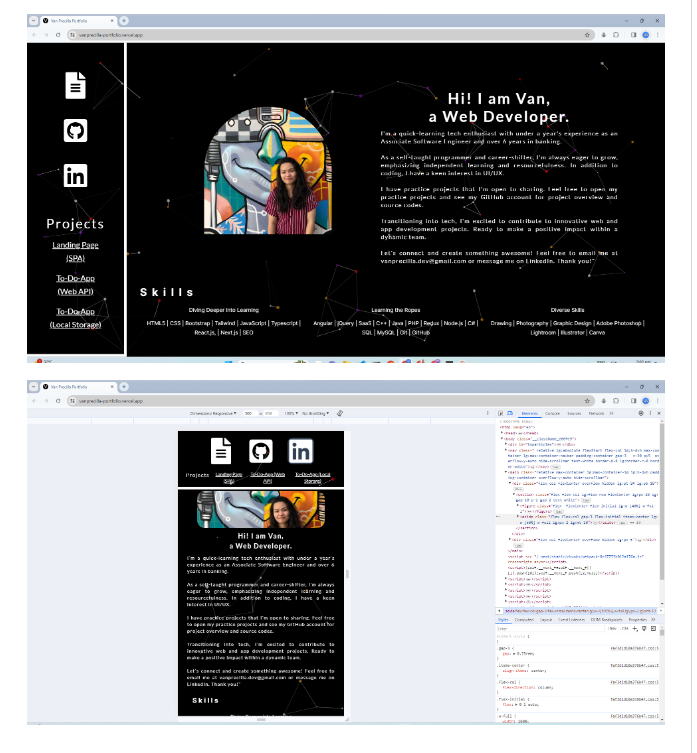

**Van Precilla Portfolio designed and code by Van**

**This is my portfolio which containes about me, my practice project for web development, my tech skills and how to communicate with me.**

Feel free to visit the live demo.** HERE IS THE LINK OF LIVE DEMO**:** https://vanprecilla-portfolio.vercel.app/**

Project Overview:

- This page is built using React.js, Next.js, JavaScript, and Tailwind.
- It serves as my portfolio, featuring sections about me, my skills, practice projects, and ways to get in touch with me.
- The portfolio is a Single Page Application (literally one page).
- It incorporates tsParticles for background animation.
- The design is web-responsive, ensuring a seamless experience on both desktop and mobile views.

